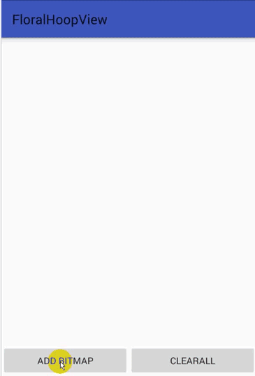

# FloralHoopView

* 技巧：我们都知道在使用Canvas作画的时候，后画的都会覆盖在先画的上面，那么如何实现绘制的最后几张，当和第一张图重叠的时候不盖住第一张。这是值得注意的地方。

# Usage

###### 1.set the widget to your xml file;
-- --
	xmlns:halohoop="http://schemas.android.com/apk/res-auto"
	...
	...
	<com.halohoop.floralhoopview.widgets.FloralHoopView
        android:id="@+id/fhv"
        android:layout_width="match_parent"
        android:layout_height="match_parent"
        app:item_radius="100"
        app:item_spread_radius="150"
        app:start_draw_angle="0" />
-- --
###### 2.findViewById;
-- --
###### 3.add new bitmap;
-- --
    mFhv.addBitmap(bitmap);
-- --
###### 4.remove all bitmap if needed;
-- --
	mFhv.clearAll();
-- --

#Customization
####### in your xml file;
####### set xmlns first;
-- --
	xmlns:halohoop="http://schemas.android.com/apk/res-auto"
-- --
#Compatibility
  
  * Android GINGERBREAD 3.0+
  
# Changelog

### Version: 1.0.0
  * Initial Build

## License

    Copyright 2016, Halohoop

    Licensed under the Apache License, Version 2.0 (the "License");
    you may not use this file except in compliance with the License.
    You may obtain a copy of the License at

       http://www.apache.org/licenses/LICENSE-2.0

    Unless required by applicable law or agreed to in writing, software
    distributed under the License is distributed on an "AS IS" BASIS,
    WITHOUT WARRANTIES OR CONDITIONS OF ANY KIND, either express or implied.
    See the License for the specific language governing permissions and
    limitations under the License.
